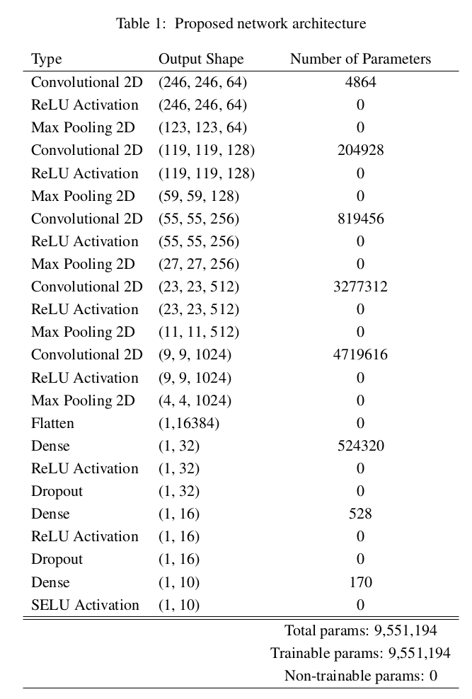
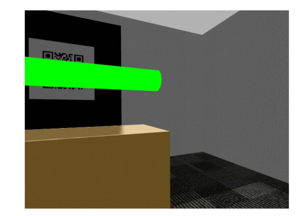
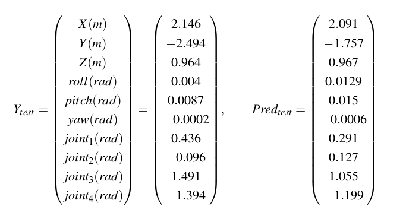
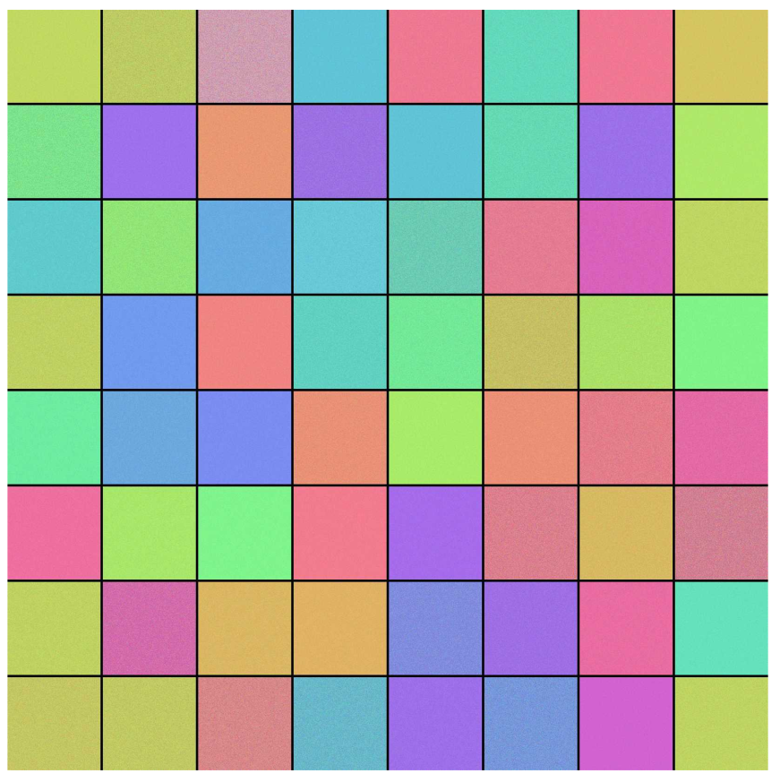
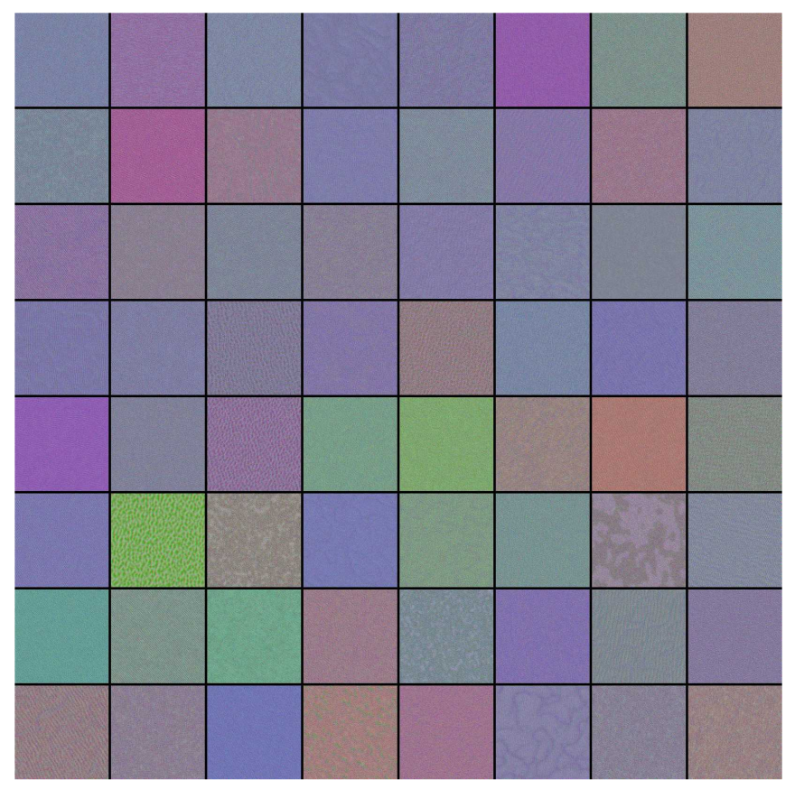
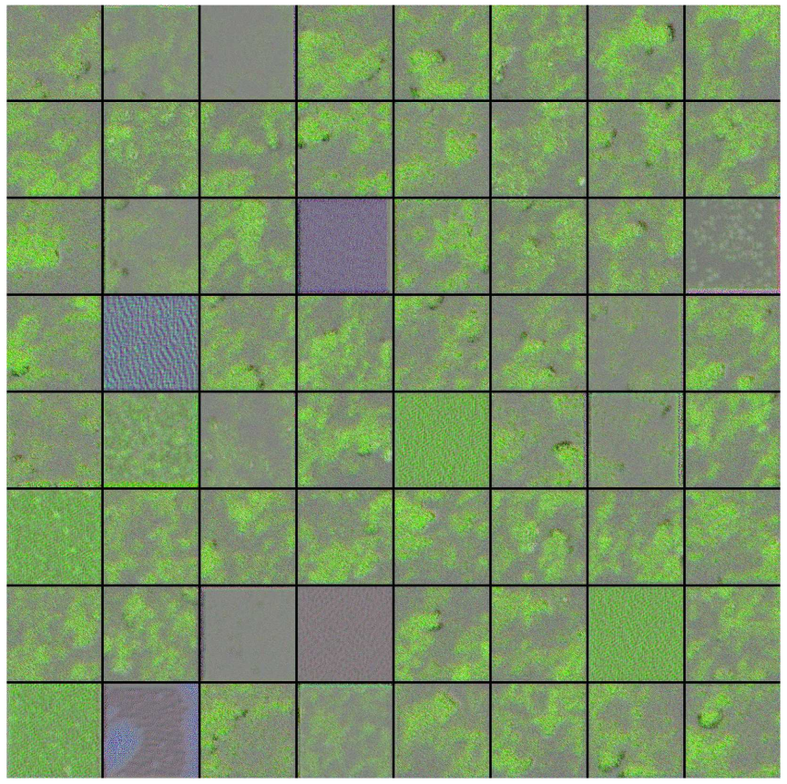
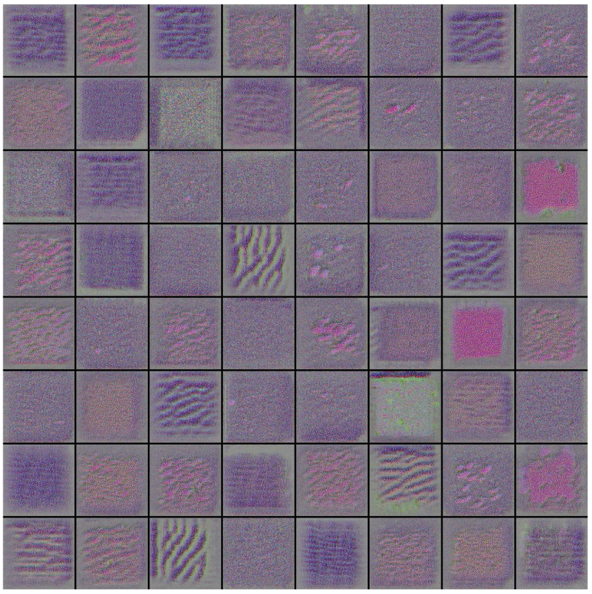
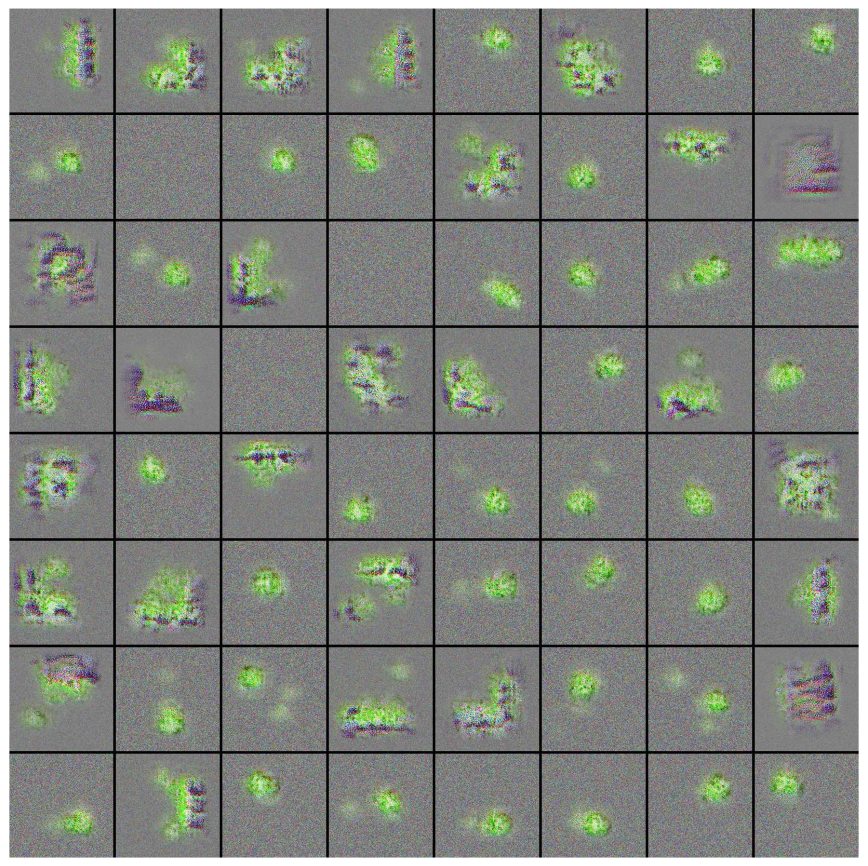

# Aerial Manipulation Configuration Estimation Using RGB Images and Keras API

Aerial manipulation (AM) systems often face challenges with uncertainty and errors in estimating their configuration, specifically the pose of the UAV and its manipulator arm. This project aims to train an aerial robot to estimate its pose autonomously using only RGB images. The setup involves the robot hovering near a highlighted cylindrical object, utilizing an eye-to-hand camera for QR code tracking and an eye-in-hand camera for generating RGB data.

This repository provides tools and models for configuration estimation in aerial manipulation tasks using deep learning techniques. The primary focus is regression-based neural networks, complemented by visualization and analysis utilities.

The following picture shows the AM in the Gazebo simulator, with both eye-to-hand and eye-in-hand RGB images.

  

## Features

- Regression with Deep Neural Networks:

  - Implements a regression model for configuration estimation.

  - Includes early stopping for optimized training.

- Model Visualization:

  - Visualize feature maps and filters from the trained neural network.

- Prediction Utility:

  - Predict configurations using the trained model on new data.

- Dataset:

  - Includes train/ and test/ directories with sample images.

## Repository Structure

configuration_estimation_aerial_manipulation/

├── regression_deep_nn.py          # Implements the regression model

├── model_prediction.py            # Prediction script using trained models

├── visualize_feature_maps.py      # Script to visualize feature maps

├── visualize_filters.py           # Script to visualize learned filters

├── output_test.csv                # Output results for test data

├── output_train.csv               # Output results for training data

├── regression_early_stopping_1.h5 # Trained model file

├── regression_early_stopping_1_weights.h5 # Trained model weights

├── train/                         # Directory containing training images

└── test/                          # Directory containing test images

## Requirements

- Python 3.8+

- Required Libraries:

  - TensorFlow / Keras

  - Matplotlib

  - NumPy

  - Pandas

## Dataset

The train/ and test/ directories contain sample images for training and testing.

Modify these directories to use your custom datasets.

## Network Architecture

In this project, a convolutional neural network (CNN) architecture is designed with five convolutional layers and three fully connected layers, incorporating MaxPooling2D, Dropout, and ReLU activation functions for the hidden layers. The output layer uses the SELU activation function. Input images are preprocessed by resizing them to 250 × 250 pixels with three color channels. The model comprises approximately 9.5 million trainable parameters.

The network is implemented using Keras, a Python-based deep learning API. It is compiled with mean squared error (MSE) as the loss function, the Adam optimizer, and the coefficient of determination (R²) as an evaluation metric. To enhance model performance, data augmentation techniques such as rotation, shifting, zooming, flipping, and brightness adjustments are applied to the training images. Additionally, early stopping is employed to prevent overfitting, with validation loss as the monitored metric, a minimum improvement threshold (min_delta) of 0.001, and a patience level of 50 epochs.

  

## Model Prediction

The following model prediction shows an example of network efficiency in estimating the configuration for a randomly selected eye-in-hand RGB image.

  

  

## What Network Learned

Visualizing the input images that maximize the activation of a target convolutional layer provides insights into what the network has learned. The following pictures illustrate these images for the first 64 filters across different layers.

In the first convolutional layer, activations are maximized by nearly plain colors, some of which correspond to colors in the sample environment. As we progress to deeper layers, the patterns become more complex. By the second layer, some patterns resemble QR code-like structures, though not conclusively.

In the third layer, distinct color associations with the cylindrical LED object emerge, with green appearing prominently in most activations. The fourth layer demonstrates grid-like patterns reflecting two key environmental features: QR-code structures and the carpet on the ground. The dominant colors range from pink to purple, resembling the carpet’s texture.

Finally, the fifth layer reveals clearer learning of the QR-code’s square frame—either fully visible or partially depicted—and the cylindrical green object. While learning the QR-code frame is not ideal, it may contribute to the network's effective regression performance.

Input images that maximize the output of the first 64 filters of 1st convolutional layer:

  

Input images that maximize the output of the first 64 filters of 2nd convolutional layer:

  

Input images that maximize the output of the first 64 filters of 3rd convolutional layer:

  

Input images that maximize the output of the first 64 filters of 4th convolutional layer:

  

Input images that maximize the output of the first 64 filters of 5th convolutional layer:

  

## Discussion

- Compared to many similar problems, the number of available data was limited in this project (540 data for training and 66 data for the test), which is equivalent to 2 minutes of operation of the aerial manipulation system in the designed environment.
- Network has to be used only under the following circumstances:
  - The AM platform is hovering in place while the arm could stretch out to servo the target. Performing other maneuvering flights may cause failure to have a low-error regression.
    
  - The green cylinder and probably the QR-code pattern are in the environment.
    
  - The surroundings may include light beams and shadows.
    
  - There could be other objects, such as boxes, windows, walls, and carpets, in the environment.
  

