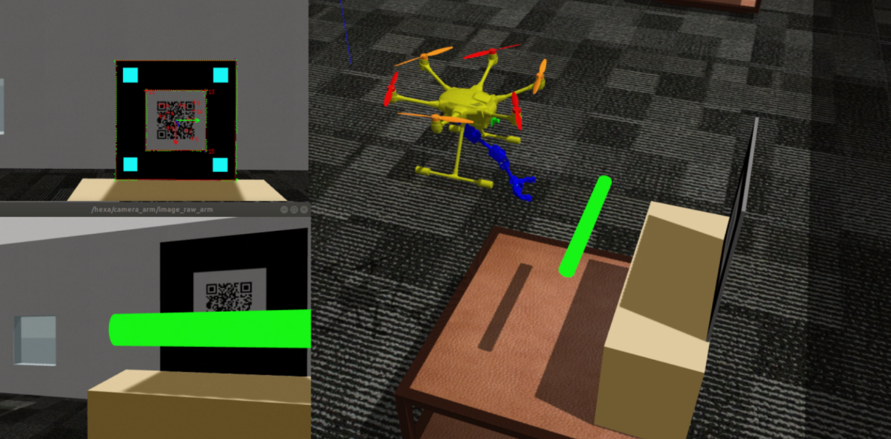

# Aerial Manipulation Configuration Estimation Using RGB Images

Aerial manipulation (AM) systems often face challenges with uncertainty and errors in estimating their configuration, specifically the pose of the UAV and its manipulator arm. This project aims to train an aerial robot to estimate its pose autonomously using only RGB images. The setup involves the robot hovering near a highlighted cylindrical object, utilizing an eye-to-hand camera for QR code tracking and an eye-in-hand camera for generating RGB data.

This repository provides tools and models for configuration estimation in aerial manipulation tasks using deep learning techniques. The primary focus is regression-based neural networks, complemented by visualization and analysis utilities.

The following picture shows the AM in the Gazebo simulator, with both eye-to-hand and eye-in-hand RGB images.

  

## Features

- Regression with Deep Neural Networks:

  - Implements a regression model for configuration estimation.

  - Includes early stopping for optimized training.

- Model Visualization:

  - Visualize feature maps and filters from the trained neural network.

- Prediction Utility:

  - Predict configurations using the trained model on new data.

- Dataset:

  - Includes train/ and test/ directories with sample images.

## Repository Structure

configuration_estimation_aerial_manipulation/

├── regression_deep_nn.py          # Implements the regression model

├── model_prediction.py            # Prediction script using trained models

├── visualize_feature_maps.py      # Script to visualize feature maps

├── visualize_filters.py           # Script to visualize learned filters

├── output_test.csv                # Output results for test data

├── output_train.csv               # Output results for training data

├── regression_early_stopping_1.h5 # Trained model file

├── regression_early_stopping_1_weights.h5 # Trained model weights

├── train/                         # Directory containing training images

└── test/                          # Directory containing test images

## Requirements

- Python 3.8+

- Required Libraries:

  - TensorFlow / Keras

  - Matplotlib

  - NumPy

  - Pandas

## Dataset

The train/ and test/ directories contain sample images for training and testing.

Modify these directories to use your custom datasets.

## Network Architecture

In this project, a convolutional neural network (CNN) architecture is designed with five convolutional layers and three fully connected layers, incorporating MaxPooling2D, Dropout, and ReLU activation functions for the hidden layers. The output layer uses the SELU activation function. Input images are preprocessed by resizing them to 250 × 250 pixels with three color channels. The model comprises approximately 9.5 million trainable parameters.

The network is implemented using Keras, a Python-based deep learning API. It is compiled with mean squared error (MSE) as the loss function, the Adam optimizer, and the coefficient of determination (R²) as an evaluation metric. To enhance model performance, data augmentation techniques such as rotation, shifting, zooming, flipping, and brightness adjustments are applied to the training images. Additionally, early stopping is employed to prevent overfitting, with validation loss as the monitored metric, a minimum improvement threshold (min_delta) of 0.001, and a patience level of 50 epochs.

